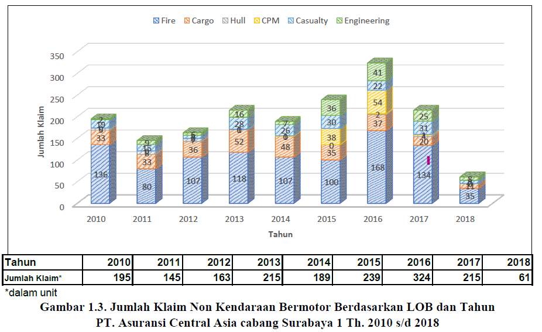
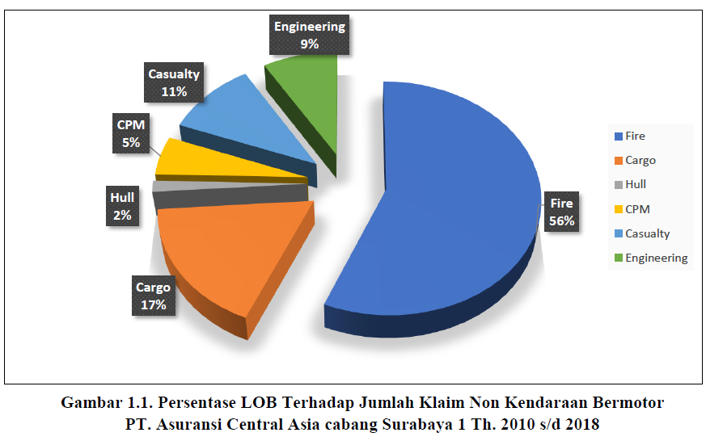
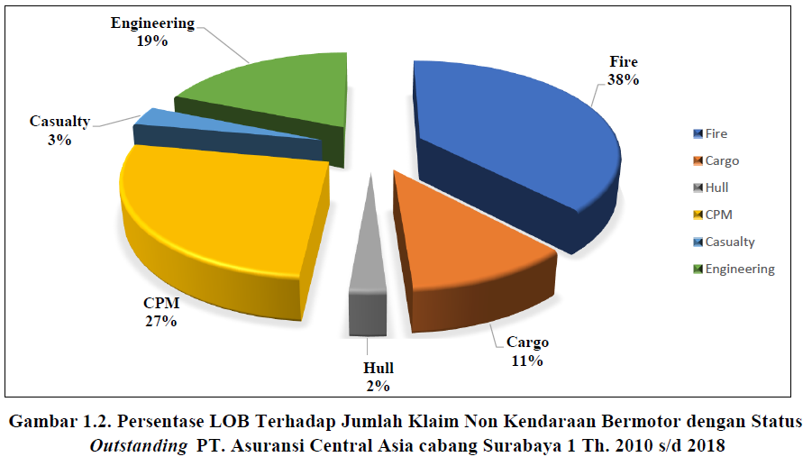
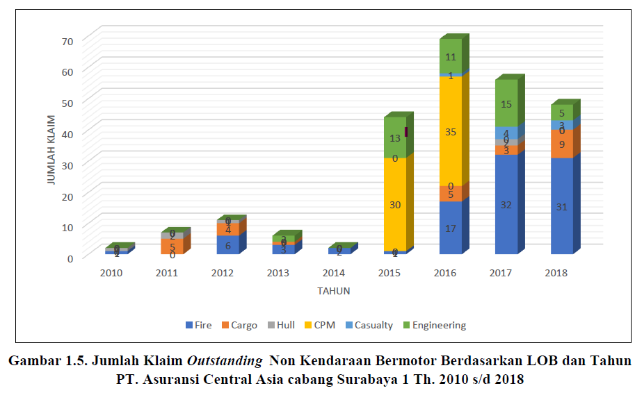
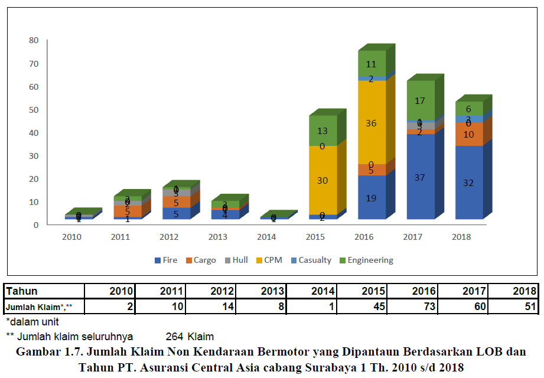
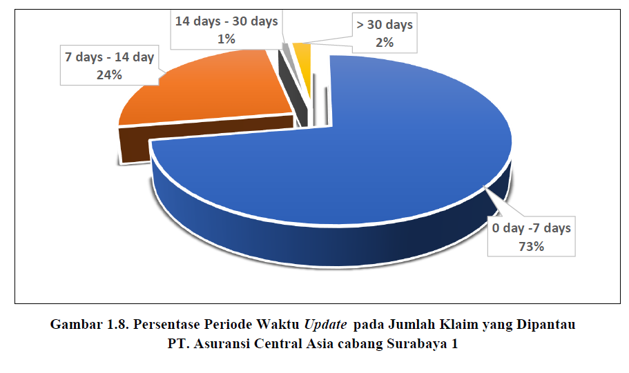
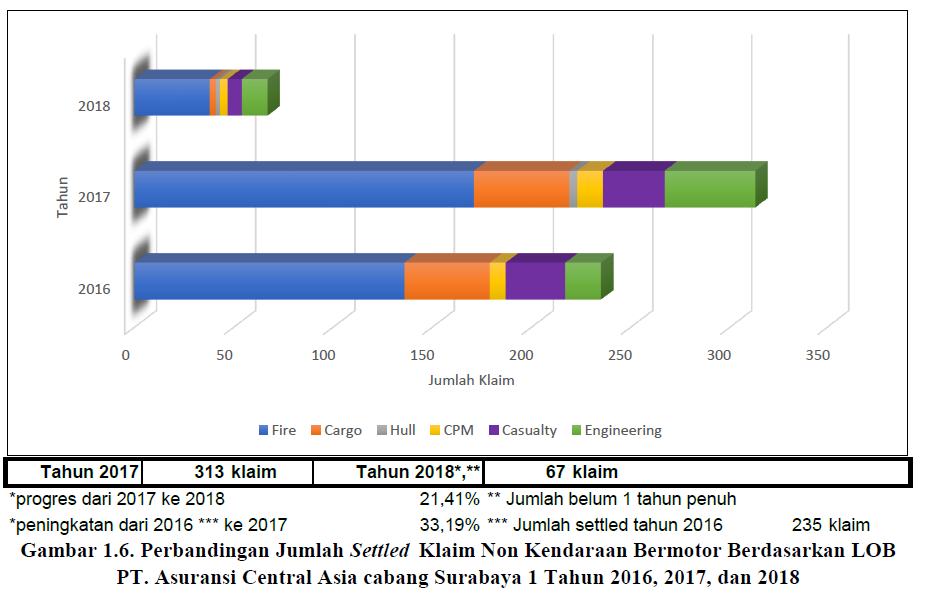

# 📊 Insurance Claims Performance Analytics Dashboard

> An automated Microsoft Excel dashboard for executive reporting and performance analysis of non-motor insurance claims.



---

# 📌 Overview

This project showcases the development of an automated Executive Reporting Dashboard using Microsoft Excel for analyzing and monitoring non-motor insurance claims.

The dashboard transforms operational claims data into meaningful business insights through KPI calculations, data visualization, and executive reports, enabling management to monitor performance and support data-driven decision-making.

> **Note:** This repository is shared for portfolio purposes only. All confidential business information has been removed or anonymized.

---

# 🎯 Business Problem

Insurance claims reporting was previously performed manually, making it difficult to monitor operational performance efficiently.

Management required a solution that could:

- Monitor overall claims performance
- Track outstanding claims
- Measure settlement performance
- Analyze trends by Line of Business (LOB)
- Monitor claims requiring follow-up
- Generate executive reports automatically

---

# 💡 Solution

Designed and developed an automated reporting solution in Microsoft Excel that:

- Consolidates claims data
- Calculates business KPIs automatically
- Generates executive dashboards
- Produces printable management reports
- Visualizes historical claims trends
- Supports operational monitoring and management decision-making

---

# 📈 Key Metrics

| Metric | Value |
|---------|------:|
| Analysis Period | 2010–2018 |
| Lines of Business | 6 |
| Dashboard Visualizations | 7 |
| Automated Reporting | ✅ |
| KPI Monitoring | ✅ |
| Executive Dashboard | ✅ |

---

# 📊 Dashboard Features

### Business Analytics

- Claims Distribution Analysis
- Outstanding Claims Analysis
- Claims Settlement Analysis
- Historical Claims Trend
- Line of Business Performance

### Operational Monitoring

- Outstanding Claims Monitoring
- Claims Under Monitoring
- Claims Update Timeliness
- Claims Aging Analysis

### Executive Reporting

- KPI Dashboard
- Automated Charts
- Printable Management Reports

---

# 📷 Dashboard Preview

## 1. Claims Distribution by Line of Business



Distribution of non-motor insurance claims across six Lines of Business.

---

## 2. Outstanding Claims Distribution



Distribution of outstanding claims across different Lines of Business.

---

## 3. Historical Claims Trend


Historical trend of insurance claims from 2010 to 2018.

---

## 4. Outstanding Claims Trend



Trend analysis of outstanding claims across all Lines of Business.

---

## 5. Claims Under Monitoring



Dashboard for monitoring claims that require continuous operational follow-up.

---

## 6. Claims Update Timeliness



Distribution of claim update intervals to evaluate operational responsiveness.

---

## 7. Claims Settlement Comparison



Comparison of claims settlement performance across reporting periods.

---

# 🛠 Technologies Used

- Microsoft Excel
- Advanced Excel Formulas
- Pivot Tables
- Pivot Charts
- Conditional Formatting
- Dashboard Design
- Data Visualization
- Automated Reporting

---

# 📈 Business Value

This solution provides significant operational benefits by:

- Automating repetitive reporting processes
- Standardizing executive management reports
- Improving visibility of claims performance
- Supporting data-driven decision-making
- Enhancing operational monitoring
- Reducing manual reporting effort

---

# 💼 Skills Demonstrated

- Business Intelligence
- Data Analysis
- Executive Dashboard Development
- KPI Development
- Insurance Analytics
- Data Visualization
- Reporting Automation
- Microsoft Excel
- Business Process Improvement

---

# 📁 Repository Structure

```text
Insurance-Claims-Performance-Dashboard
│
├── LICENSE
├── README.md
├── claims-settlement-comparison.png
├── claims-trend-by-line-of-business.png
├── claims-under-monitoring-by-lob.png
├── claims-update-period-distribution.png
├── lob-distribution-dashboard.png
├── outstanding-claims-by-lob.png
└── outstanding-claims-trend-by-lob.png
```

---

# 🚀 Future Enhancements

Future improvements may include:

- Power BI Dashboard
- SQL Database Integration
- Python-based Data Processing
- Automated ETL Pipeline
- Interactive Dashboard using Streamlit
- Predictive Claims Analytics with Machine Learning

---

# 📄 Disclaimer

This repository is intended for educational and portfolio purposes only.

All confidential business information has been removed or anonymized. The dashboards demonstrate reporting automation, business intelligence, KPI monitoring, and data visualization techniques without disclosing proprietary company information.

---

# 👨‍💻 Author

**Ahmad Subari**

Claims Analyst | Marine Cargo Surveyor | Data Analytics Enthusiast

- 💼 LinkedIn: https://www.linkedin.com/in/ahmadsubari23
- 💻 GitHub: https://github.com/ahmadsubari23
- 📧 Email: ahmad.subari23@gmail.com

---

⭐ If you found this project interesting, please consider giving it a star!
